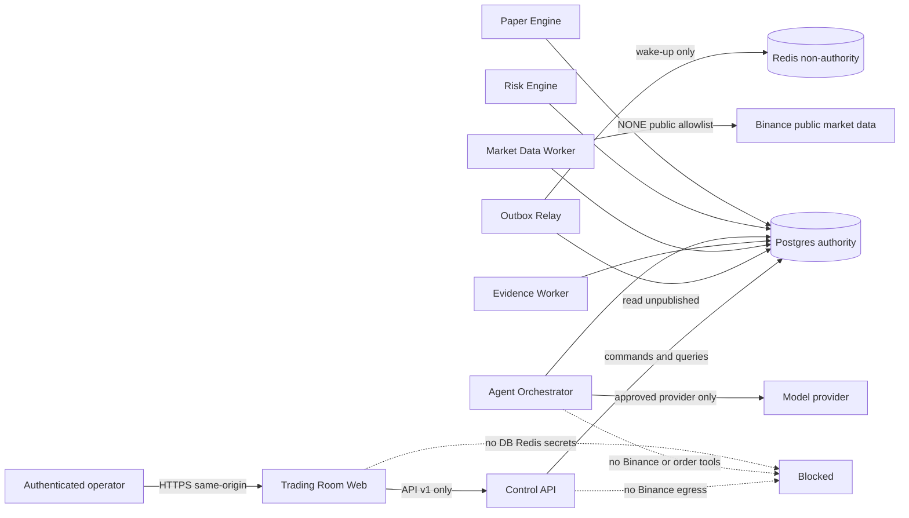
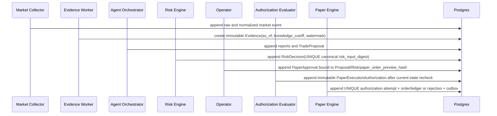

# P0-04·P0-05·P0-10 아키텍처와 안전 경계

> Phase schedule amendment: Phase 5 Approval/Authorization creation references below are
> superseded by `../phase-5/phase-0-contract-amendment.md`; those objects and AUTH scenarios
> are reassigned to Phase 7. RiskDecision and Kill Switch remain Phase 5.

- 상태: `POLICY_APPROVED — final review and evidence digest pending`
- 제품 Phase: `0` (문서 전용; 아래 경로와 프로세스는 해당 creation phase 전에는 만들지 않는다)
- 대상: Phase 1~7 Paper MVP, Phase 8 Testnet은 격리된 미래 확장
- 핵심 원칙: Postgres 단일 권위, Redis 비권위, AI/브라우저 주문 권한 0, Phase 1~7 Testnet/private capability 0

## 1. 결정 요약

| ID | 결정 | 이유 | 대안과 기각 이유 |
|---|---|---|---|
| A-01 | 최종 저장소는 Python 서비스, Next.js 앱, versioned contracts를 한 monorepo에서 관리한다. | 원자적 계약 변경과 producer-consumer 검증이 MVP 규모에 적합하다. | 서비스별 저장소는 독립 배포에는 유리하지만 Phase 1~7의 계약 drift와 운영 복잡도를 키운다. |
| A-02 | deployable process별로 쓰기 권위를 분리하고, 같은 Postgres cluster 안에서 schema/table owner를 분리한다. | 원자성·감사·복구를 유지하면서 서비스 책임을 명확히 한다. | 모든 서비스가 모든 table에 쓰는 shared database 모델은 우회 변경과 원장 불변식 위반을 허용한다. |
| A-03 | Redis는 cache, ephemeral coordination, wake-up hint만 담당한다. 금융·승인·Kill Switch·idempotency의 권위는 Postgres다. | Redis 유실 또는 재시작이 거래 상태를 바꾸지 않게 한다. | Redis queue/lock을 권위로 쓰면 유실·split-brain에서 중복 effect가 생긴다. |
| A-04 | 공개 market-data adapter는 `market-data-read`만 표현하며 범용 `exchange_client`를 두지 않는다. | public/private 기능이 같은 client·config·secret path로 확장되는 것을 구조적으로 막는다. | host block만으로는 같은 host의 private path와 인증 capability를 막지 못한다. |
| A-05 | Proposal, Risk, Paper Approval, PaperExecutionAuthorization, Paper Order를 서로 다른 불변 aggregate로 둔다. | AI 제안, 결정론적 허용, 사람 의사, 실행 직전 재검증을 분리한다. | 한 `order_request` 객체에 합치면 승인 후 변경과 hash drift를 감지하기 어렵다. |
| A-06 | API는 command/query를 분리하고, 상태 변경은 Postgres transaction의 inbox/domain/ledger/outbox 원자성으로 전파한다. | retry와 process crash에서도 effect가 한 번만 반영되게 한다. | 동기 HTTP chain만 사용하면 중간 실패에서 부분 성공을 복구하기 어렵다. |
| A-07 | Phase 1~7에는 Testnet URL, schema, package, process, DI binding, env key, credential 입력이 0개다. | Phase 8 전 외부 주문 capability를 만들지 않는 phase gate를 구현 구조로 증명한다. | 미리 비활성 stub를 두는 방식도 capability 존재이므로 금지한다. |
| A-08 | 금융 workflow는 consumer contract/schema의 **creation phase**와 production route의 **activation phase**를 분리한다. P4 Paper와 P5 Risk는 다음 producer의 closed contract fixture로 RED→GREEN을 수행하되 위험 route는 P6 full-chain 검증 전 비활성이다. | P4→P5→P6의 bottom-up 구현에서 미래 table FK나 단계 월경 없이 각 Phase gate를 독립적으로 닫는다. | P4 schema가 P5/P6 table을 미리 FK로 참조하거나, P5 Risk route를 fixture 입력으로 production 활성화하면 phase gate와 권위 chain을 모두 우회한다. |

## 2. 최종 monorepo tree와 creation phase

아래는 최종 목표 구조다. `[P<n>]`은 **처음 생성할 수 있는 제품 Phase**이며 그 이전에는 디렉터리·빈 placeholder·schema·설정도 존재하면 안 된다. 단, Phase 계약이 명시적으로 요구하는 Phase 1 FastAPI/Next.js health·config shell은 승인된 실행 골격 자체이므로 금지 placeholder가 아니다. 이 shell에는 Trading Room domain 화면·승인·Kill·Paper/Testnet capability를 넣지 않고 Phase 7에 실제 GUI 기능을 추가한다. Phase 0에서는 이 문서만 존재한다.

```text
/
├─ package.json, pnpm-workspace.yaml    [P1] root command/workspace contract
├─ pyproject.toml                       [P1] uv Python workspace contract
├─ compose.yaml                         [P1] infra/compose의 root entry
├─ .github/workflows/ci.yml             [P1] Phase-aware required job graph
├─ apps/
│  └─ trading-room-web/                 [P1] Next.js health/config shell; [P7] Trading Room query·승인·Kill UI
├─ services/
│  ├─ control-api/                      [P1] FastAPI ingress, authn, command/query routing
│  ├─ outbox-relay/                     [P1] Postgres outbox 전달; 상태 권위 없음
│  ├─ market-data-worker/               [P2] Binance Spot 공개 NONE 데이터 수집·raw append
│  ├─ evidence-worker/                  [P3] feature와 point-in-time Evidence 생성
│  ├─ paper-engine/                     [P4] Paper LIMIT lifecycle, fill, portfolio, ledger
│  ├─ risk-engine/                      [P5] 결정론적 RiskDecision과 실행 직전 검증 입력
│  ├─ agent-orchestrator/               [P6] Evidence 전용 AI 분석·TradeProposal
│  └─ spot-testnet-gateway/             [P8] 별도 승인 뒤 처음 추가; Phase 1~7에는 부재
├─ packages/
│  ├─ contracts/                        [P1] OpenAPI/JSON Schema/event schema v1 정본
│  ├─ python/
│  │  ├─ platform-core/                 [P1] UTC ID/hash/error/DB transaction primitives
│  │  ├─ market-data-contracts/         [P2] public allowlist와 normalization types
│  │  ├─ evidence-domain/               [P3] PIT selection과 immutable Evidence
│  │  ├─ paper-domain/                  [P4] Decimal order/ledger invariants
│  │  ├─ risk-domain/                   [P5] versioned deterministic policy
│  │  └─ agent-domain/                  [P6] report/proposal schema; 주문 포트 없음
│  └─ typescript/
│     └─ contract-bindings/             [P1] health/config binding; [P7] Trading Room read/command types
├─ db/
│  ├─ migrations/                       [P1] 승인된 Phase schema만; reversible migration graph
│  └─ seeds/                            [P1] 비밀 없는 로컬 정적 참조 데이터만
├─ infra/
│  ├─ compose/                          [P1] Postgres·Redis·승인된 process 로컬 구성
│  ├─ network-policy/                   [P1] process별 ingress/egress allowlist
│  └─ observability/                    [P1] log/metric/trace schema; secret redaction
├─ tests/                               [P1] Phase별 승인 시 RED부터 생성
│  ├─ unit/                             [P1]
│  ├─ integration/                      [P1]
│  ├─ contract/                         [P1]
│  ├─ safety/                           [P1]
│  ├─ replay/                           [P2]
│  ├─ property/                         [P2] DATA-007부터; [P4] 금융 corpus 추가
│  ├─ failure/                          [P2]
│  └─ e2e/                              [P7]
└─ docs/woozoo-trading-desk/            [P0] 설계·acceptance·working history
```

`spot-testnet-gateway` 외에도 Testnet command/event schema와 credential config는 P8에 처음 추가한다. `exchange-client`, `broker-adapter`, `live-mode` 같은 범용 미래 확장 경로는 어느 Phase에도 만들지 않는다.

## 3. deployable process와 권위

| Process | 최초 Phase | 단독 쓰기 권위 | 허용 입력/출력 | 명시적 비권위·금지 |
|---|---:|---|---|---|
| `control-api` | 1 | actor session, command receipt, read-model cursor | Browser inbound; versioned command/query; Postgres/outbox | 금융 계산·Risk 허용·AI 판단·Binance egress 금지 |
| `outbox-relay` | 1 | delivery attempt metadata만 | Postgres outbox 읽기, 내부 bus/consumer wake-up | domain event 생성·payload 변경·권위 상태 변경 금지 |
| `market-data-worker` | 2 | raw market event, normalized market event, collector quality | 공식 allowlist의 keyless public REST/WS; Postgres | API key/signature/listen key/order/account/user-data/Testnet 금지 |
| `evidence-worker` | 3 | feature observation, Evidence snapshot/provenance | normalized data와 simulation clock; Evidence event | late data로 기존 Evidence 수정 금지; wall-clock fallback 금지 |
| `paper-engine` | 4 | Paper order/fill/position/lot/ledger; immutable command rejection과 Authorization attempt/consumption receipt | 승인된 Paper command, Risk/Approval hash, Postgres transaction | risk-owned Authorization UPDATE, Binance network/secret, LLM 결과를 잔고로 사용, 음수 position 금지 |
| `risk-engine` | 5 | RiskDecision, PaperExecutionAuthorization, Kill Switch state/event | canonical Proposal, portfolio, data, order preview, policy/calculator, Kill, reconciliation, clock, duplicate/exposure snapshots와 Approval | LLM·UI가 verdict/숫자/`risk_input_digest`를 덮어쓰기 금지; 거래소 인증 금지 |
| `agent-orchestrator` | 6 | analysis run, accepted report, TradeProposal | immutable Evidence, model provider | DB 금융 table write, Risk/approval/order tool, Binance egress 금지 |
| `trading-room-web` | 1 shell / 7 기능 | 없음 | P1은 health/config만; P7부터 `control-api` query와 좁은 operator command | P1 domain UI·승인·Kill/Paper control 금지; 항상 DB/Redis/Binance/model direct access와 secret 수신 금지 |
| `spot-testnet-gateway` | 8 | 외부 Testnet submission/reconciliation record | 인증된 deterministic execution command만 | Phase 1~7 부재; browser/AI inbound, Mainnet private, withdrawal/Futures 금지 |

각 Postgres schema는 위 소유 process의 DB role만 `INSERT/UPDATE`할 수 있다. 다른 process는 계약된 view/query 또는 event를 사용한다. immutable table은 owner에게도 `UPDATE/DELETE`를 허용하지 않고 correction event만 append한다.

### 3.1 creation phase와 activation phase

| 제품 Phase | 생성·검증할 수 있는 것 | production activation gate |
|---:|---|---|
| 4 | Paper domain, order/fill/position/ledger schema와 P5 `PaperExecutionAuthorization` consumer contract fixture. fixture ID는 test namespace에만 있고 production row/FK가 아니다. | internal/public Paper create route, scheduler fill ingress와 production order 생성은 `OFF`; 미래 risk/authorization FK를 만들지 않는다. |
| 5 | Risk policy/decision/Authorization/Kill schema와 P6 `TradeProposal` consumer contract fixture; 이미 존재하는 P4 authorization reference에는 이 Phase migration에서만 FK를 추가할 수 있다. | risk-evaluation, approval→authorization, Paper create/fill production chain은 계속 `OFF`; fixture Proposal로 production RiskDecision을 만들 수 없다. |
| 6 | agent-orchestrator와 authoritative TradeProposal schema/event; P5의 opaque Proposal reference를 실제 FK로 승격하고 full-chain contract/integration/replay 검증을 fixture/test namespace에서 수행한다. | login/session/approval/authorization/Paper production route와 aggregate 생성은 계속 `OFF`다. |
| 7 | operator UI와 browser E2E | authenticated login/session과 `Proposal→Risk→Approval→Authorization→Paper` production chain을 함께 활성화하되 browser가 internal route를 직접 호출하지 않는다. |

contract fixture는 해당 producer의 canonical closed schema를 소비자가 먼저 고정하기 위한 테스트 입력일 뿐 DB seed, production event 또는 production aggregate가 아니다. producer가 도착하면 같은 fixture corpus를 producer serialization과 대조하고, fixture-only identifier가 production DB에 존재하면 startup/CI가 실패해야 한다. 이 규칙으로 P4/P5 migration은 아직 존재하지 않는 P5/P6 table을 참조하지 않는다.

## 4. dependency direction

```text
apps/trading-room-web
        ↓ generated read/command bindings
packages/contracts ← services/control-api ← internal command/query ports
        ↑                         ↑
domain packages ─────────── deployable services
        ↓
packages/python/platform-core
```

허용 방향은 `apps/services → domain package → platform-core`, 그리고 모든 process가 `contracts`에 의존하는 방향뿐이다. 다음 역방향은 금지한다.

- domain package가 FastAPI, Next.js, Redis, model provider 또는 Binance transport에 의존한다.
- `agent-domain`이 `paper-domain`의 실행 port나 Risk policy mutation을 import한다.
- public market-data package가 Testnet/private package 또는 secret type을 import한다.
- UI binding이 서버 내부 model이나 DB row를 정본으로 삼는다.
- 한 service가 다른 service의 table을 직접 갱신한다.
- P4/P5 consumer가 미래 producer package나 table을 import/FK하고 이를 “계약 검증”으로 부르는 것.

## 5. Postgres 권위와 Redis 비권위

Postgres는 다음의 유일한 durable authority다.

- command idempotency와 inbox dedupe
- raw/normalized market data, quality, Evidence와 provenance
- reports, Proposal, RiskDecision, Paper Approval과 risk-owned immutable Authorization
- Paper order/fill/position/lot, commodity ledger, reconciliation
- paper-owned immutable Authorization attempt/consumption receipt와 rejected command receipt
- Kill Switch, audit event, outbox와 event delivery 상태

각 owner의 상태 변경 transaction은 그 owner의 `inbox receipt + idempotency result + domain state/event + ledger posting(해당 시) + outbox event`를 함께 commit한다. 서로 다른 owner의 전이를 하나의 cross-owner transaction으로 주장하지 않는다. 특히 paper-engine은 risk-owned Authorization row를 갱신하지 않고, 첫 실행 시도에 `authorization_id UNIQUE`인 paper-owned attempt/consumption receipt를 order/ledger 또는 immutable rejection receipt와 같은 paper transaction에 append한다. 성공·guard 실패·version drift 어느 결과든 한번 기록된 Authorization은 재사용 0이며 risk-engine의 consumed/blocked projection은 paper outbox event를 inbox-dedupe하여 재구성한다. Redis 장애 시 cache를 폐기하고 Postgres에서 재구성하며, 신규 결정은 필요하면 HOLD한다. Redis에는 approval/authorization nonce의 유일본, Kill 상태, 잔고, order state, ledger balance, consumed-event 유일본을 저장하지 않는다. Redis pub/sub 유실은 Postgres outbox polling으로 회복해야 한다.

## 6. 신뢰·network·secret·egress 경계



| Zone | Ingress | Egress | Secret | 실패 방식 |
|---|---|---|---|---|
| Browser | same-origin UI | `control-api`만 | 없음 | direct DB/Binance URL 또는 secret field가 있으면 build/CI 실패 |
| Control plane | browser와 내부 authenticated service | Postgres/Redis 내부만 | Argon2id verifier, server-side session secret, bootstrap plaintext는 local secret path만 | `TRADING_MODE` 누락·`paper` 외 값이면 startup 실패; plaintext·cookie signing key는 browser/log/trace에 노출 금지 |
| Public-data | 내부 scheduler | 승인된 `NONE` method+path+stream allowlist와 Postgres | 없음 | auth header/key/signature 요구 또는 allowlist 밖이면 network 전 거절 |
| AI | internal command | model provider allowlist와 read-only internal Evidence | provider credential만 별도 path | credential은 prompt/tool/log/trace/error에 금지; Binance route는 deny |
| Deterministic finance | authenticated internal command/event | Postgres/Redis 내부만 | exchange secret 없음 | stale/Kill/ledger mismatch/hash mismatch면 신규 Paper effect 0 |
| Data stores | 내부 service account | backup/observability allowlist | DB/Redis credential | public ingress 금지; role별 schema write 제한 |
| Future P8 gateway | P8 authenticated execution service만 | Spot Testnet capability allowlist만 | Testnet trade key, withdrawal 권한 없음 | 기본 OFF; Mainnet/private mismatch 또는 reconciliation 실패면 startup/command 거절 |

Phase 1~7 network policy에는 `spot-testnet-gateway` zone이나 Testnet egress rule이 존재하지 않는다. public-data host가 production Spot와 관련되어도 안전 판정은 `method + path/stream + auth=NONE + capability=market-data-read`의 네 요소를 함께 검사한다.

## 7. Paper dataflow와 실행 순서



정본 순서는 `Evidence → TradeProposal → RiskDecision(allowed) → PaperApproval → PaperExecutionAuthorization → PaperOrder`다. Risk는 사람 승인 전에 평가되어 승인 화면의 입력이 된다. 승인 후에는 Authorization evaluator가 기존 Risk hash와 현재 data/Kill/ledger 상태를 다시 검증하지만 새로운 RiskDecision을 소급 생성하지 않는다.

위 순서는 production activation 순서이며 P4/P5의 bottom-up 구현 순서와 다르다. P4와 P5는 각각 다음 producer의 closed consumer contract fixture만 사용하고 production create/risk route를 열지 않는다. P6 producer가 도착해 실제 FK와 end-to-end contract를 검증하기 전에는 fixture가 이 production chain을 만족시킨 것으로 간주하지 않는다.

`PaperApproval → RiskDecision → PaperExecutionAuthorization`로 읽힐 수 있었던 전달 문구는 오케스트레이터 판정에 따라 기존 권위 MVP 계약으로 해결했다. 정본 후보는 `RiskDecision → PaperApproval → PaperExecutionAuthorization`이며 반대 순서는 금지한다. safety QA는 이 resolution이 세 문서와 producer-consumer 계약에 동일하게 반영됐는지 확인한다.

## 8. Kill Switch 권위

- Kill Switch 상태와 모든 전이는 risk-owned Postgres append-only safety event와 shared authoritative barrier projection으로 관리한다.
- activation은 먼저 barrier row를 exclusive lock하고 version 증가와 `active=true`, activation event, risk outbox를 **risk transaction 하나로 commit**한다. 이 commit은 열린 주문 취소와 한 cross-owner transaction이 아니다.
- 모든 paper create와 fill transaction은 같은 barrier row/version을 잠그고 검사한다. paper transaction이 먼저 lock했다면 그 효과가 commit된 뒤 activation이 진행되어 논리적으로 activation 이전이다. activation이 먼저 lock/commit했다면 대기하던 create/fill은 새 version의 `active=true`를 보고 effect 0으로 끝난다. 따라서 activation commit 뒤에 create/fill이 commit되는 serialization은 허용하지 않는다.
- barrier commit 뒤 `kill-switch.activated` outbox를 소비한 paper-engine이 열린 주문을 deterministic order의 idempotent saga/batch로 감사 취소하고 hold를 해제한다. 중단·중복 delivery는 같은 batch key로 재개하며 gate는 취소 완료와 무관하게 계속 닫혀 있다.
- `active` 전이는 신규 분석 기반 Proposal 승격, Paper 승인, Authorization, Paper order command를 차단한다.
- recovery는 인증된 operator, 원인·조치, 예상 version과 새 event를 요구한다. AI, timer, restart, Redis TTL로 자동 해제할 수 없다.
- stale/invalid data, ledger imbalance, reconciliation failure는 명시적 reason code로 fail-closed한다.
- 활성화와 recovery 모두 API/event v1 계약과 optimistic concurrency를 따른다.

## 9. P0-10 구조적 불가능성 증명 계약

P0-10은 다음 네 층이 모두 PASS일 때만 후보 PASS다.

1. **Dependency:** Phase 1~7 graph에 private/signed/Testnet SDK, gateway, generic exchange client, account/user-data port가 0개다.
2. **Configuration:** API key, signature, Testnet/private/order/account URL, `live|testnet` mode를 표현하는 config가 0개다. `TRADING_MODE=paper` 외에는 startup non-zero다.
3. **Capability:** public collector, AI, browser, API schema가 order/cancel/account/user-data method를 표현하지 못한다.
4. **Network:** collector는 keyless public allowlist, AI는 provider allowlist, finance services는 internal-only다. Phase 1~7 Testnet/private egress rule은 0개다.

검증은 `verification-strategy.md`의 SAFE-001~004를 사용하며 hostname 문자열 검색만으로 PASS하지 않는다.

## 10. 승인된 아키텍처 결정

| Decision | 권고 후보 | 승인 전 상태/영향 |
|---|---|---|
| D-ARCH-01 MVP cut | Phase 0~7 Paper MVP, Phase 8 Testnet 별도 | DP-D01 승인; final review/evidence digest 전 P0 verdict 미확정 |
| D-ARCH-02 optional sources | 파생 telemetry와 뉴스·소셜은 Release 1.1 이월 | DP-D02 승인; placeholder도 생성 금지 |
| D-ARCH-03 actor auth | Argon2id verifier + server-side session의 로컬 단일 operator | DP-D07 승인; auth schema/RED는 Phase 5, browser route는 Phase 7 |
| D-ARCH-04 process split | market/evidence/paper/risk/control/outbox/web의 bounded process graph와 하나의 `agent-orchestrator` process | AI의 market/technical·flow·Bull·Bear·Trader·Portfolio·Audit는 logical report roles이며 별도 process/tool authority가 아님 |

## 11. Acceptance 후보

### D-ARCH implementation clarification

DP-D07 fixes the local operator boundary: Phase 5 creates only auth schema and RED contracts, while browser login/logout and approval routes activate in Phase 7. `agent-orchestrator` is one deployable process; its market/technical, flow, Bull, Bear, Trader, Portfolio, and Audit outputs are logical report roles without separate process, model, tool, or financial authority.

- P0-04: tree의 모든 경로에 creation phase가 있고, P4/P5/P6 consumer creation과 production activation, 승인된 P1 FastAPI/Next.js shell과 금지된 미래 capability placeholder가 구분된다.
- P0-05: process authority, dependency, Postgres/Redis, trust/network/secret/egress 경계가 일관된다.
- P0-10: Phase 1~7의 dependency/config/capability/network 네 층에서 Mainnet private와 Testnet order capability가 0이다.
- 공통: 이 파일의 SHA-256·verdict가 최종 evidence manifest에 결속되고 safety QA가 producer-consumer 계약을 교차 검증한다.

## 다음 단계 참조

- `data-model-and-retention.md`는 이 문서의 schema owner, Postgres authority, immutable/outbox/inbox 규칙을 물리 데이터 계약으로 구체화한다.
- `api-and-event-contracts.md`는 정본 순서 `Proposal → RiskDecision → PaperApproval → PaperExecutionAuthorization`과 Kill Switch command/event를 v1로 고정한다.
- D-ARCH-01~04는 DP-D01·02·03의 policy approval과 정합하다. 이 결정은 final review와 evidence digest 전 P0 PASS 근거가 아니며, 승인 순서 충돌은 `RESOLVED_BY_AUTHORITATIVE_MVP_CANDIDATE`로 닫혔다.
- Phase 1 승인 전에는 위 tree의 앱·서비스·migration·test·fixture·scaffold를 생성하지 않는다.
