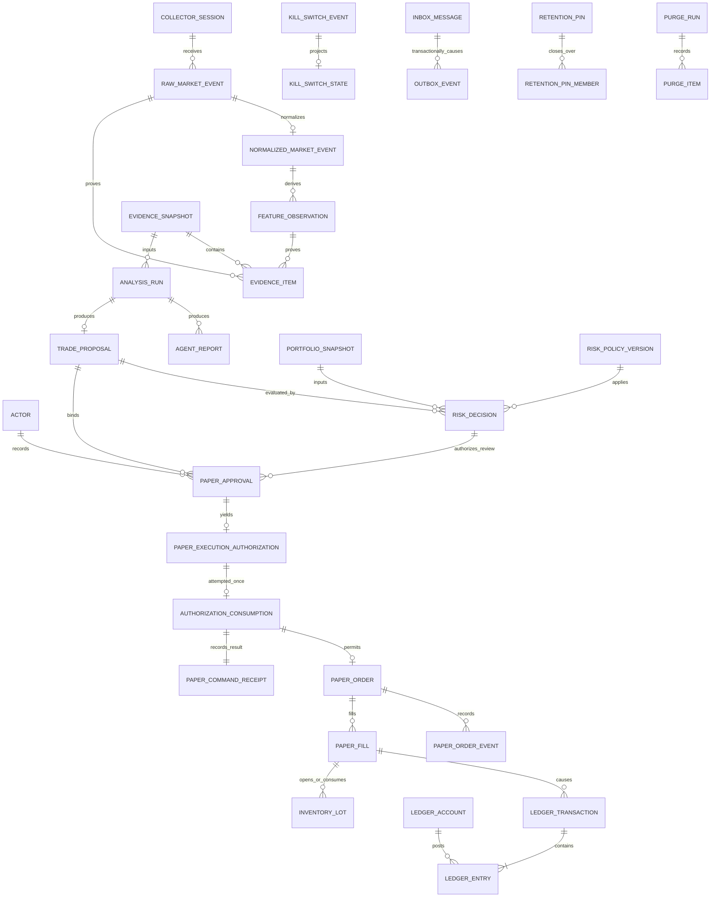

# P0-06 데이터 모델·ERD·보존 계약

- 상태: `POLICY_APPROVED — final package review/evidence digest pending`
- 제품 Phase: `0` (schema와 migration을 만들지 않는 문서 설계)
- 저장 권위: Postgres. Redis는 cache/wake-up/ephemeral coordination일 뿐 권위가 아니다.
- 공통 표현: 금융 값은 Decimal이며 API/event에서는 string, DB에서는 `NUMERIC`으로 저장한다. 모든 시각은 UTC `TIMESTAMPTZ`, 외부 계약은 UTC ISO-8601이다.

## 1. 모델링 결정

| ID | 결정 | 이유 | 대안과 기각 이유 |
|---|---|---|---|
| DM-01 | 내부 PK는 UUIDv7 후보, source 고유키는 별도 UNIQUE로 둔다. | 시간 정렬 가능성과 source replay dedupe를 분리한다. | source ID를 PK로 쓰면 source별 충돌과 schema migration 결합이 생긴다. |
| DM-02 | raw, Evidence, report, Proposal, Risk, approval, authorization, authorization attempt/consumption, command rejection, fill, ledger, audit, inbox/outbox event는 append-only다. | point-in-time 재현과 감사가 가능하다. | UPDATE로 최신값만 남기면 당시 지식과 승인 hash를 재구성할 수 없다. |
| DM-03 | order/position/quality/Kill의 현재 row는 projection이고, append-only event가 원인 기록이다. | 빠른 query와 완전한 이력을 함께 제공한다. | projection만 저장하면 replay·대조 oracle이 없다. |
| DM-04 | commodity 원장은 transaction header + entry rows이며 transaction과 commodity별 debit-credit가 정확히 0이다. | BTC·ETH·USDT·fee asset을 서로 상계하지 않는다. | 단일 통화 금액 원장은 수수료 asset과 자산 보존을 숨긴다. |
| DM-05 | outbox/inbox/idempotency와 domain/ledger change를 한 Postgres transaction으로 commit한다. | crash·retry에도 중복 effect를 차단한다. | Redis lock과 delivery ack만으로 exactly-once를 주장할 수 없다. |
| DM-06 | Evidence digest는 선택 기준, watermark, collector quality, provenance row 집합에 결속한다. | late arrival가 과거 snapshot을 오염하지 못한다. | 조회 시 동적으로 Evidence를 계산하면 동일 ID가 바뀐다. |
| DM-07 | retention pin은 대상과 모든 provenance ancestor를 닫힌 집합으로 보호한다. | Evidence만 남고 raw 근거가 지워지는 상태를 막는다. | table별 독립 TTL은 감사 체인을 절단한다. |

## 2. 공통 column 계약

| 종류 | 계약 |
|---|---|
| PK | `id UUID`, UUIDv7 후보. 외부 source 식별자는 PK와 분리한다. |
| 시간 | `created_at`, `occurred_at`, `event_time`, `received_at`, `as_of`, `knowledge_cutoff`는 UTC `TIMESTAMPTZ`; local timezone 저장 금지 |
| Decimal | DB 후보 `NUMERIC(38,18)`; 원문은 `raw_decimal_text` 또는 raw payload에도 보존. float 입력 금지 |
| Hash | `sha256` lowercase hex 64자; canonical JSON과 적용 schema/policy version을 함께 기록 |
| Version | mutable projection은 `row_version BIGINT >= 1`; immutable contract는 `schema_version`/`policy_version` 명시 |
| Correlation | 모든 상태변경 row/event에 `correlation_id`, 원인에는 `causation_id` 또는 source FK |
| Soft delete | 권위·감사 row에는 사용하지 않는다. purge/archival은 별도 append-only manifest로 수행 |

`NUMERIC(38,18)`과 rounding mode는 `phase-0-approval-record.md`의 DP-D04 승인으로 채택됐다. 구현 전 BTC/ETH/USDT source filter와 PnL oracle로 precision을 검증하고, 부족하면 migration 전에 문서와 contract version을 올린다.

`as_of`와 `knowledge_cutoff`는 서로 대체하지 않는 두 축이다. `as_of`는 source event-time horizon이고 `knowledge_cutoff`는 local receive-time horizon이다. Evidence worker가 명시적으로 전달된 두 값을 snapshot recipe와 simulation clock에 결속하고 `event_time <= as_of AND received_at <= knowledge_cutoff`를 적용한다. replay/test harness와 운영 scheduler가 clock 값을 고정하며 Evidence worker가 wall clock으로 누락값을 보충하지 않는다. 두 clock 사이의 암묵적 대소관계는 가정하지 않고 recipe version이 허용 관계와 inclusive 경계를 기록한다.

## 3. 논리 ERD

ERD의 `PAPER_APPROVAL → PAPER_EXECUTION_AUTHORIZATION` 사이에는 이미 존재하는 `RISK_DECISION(verdict=allowed)`가 필수다. 정본 생성 순서는 Proposal → Risk → Approval → Authorization이다.

ERD는 최종 논리 관계이며 migration 생성 순서를 뜻하지 않는다. P4는 Paper schema와 P5 Authorization의 closed consumer contract를 test fixture로만 검증하고 `authorization_id`를 opaque typed reference로 저장하되 미래 table FK를 만들지 않는다. P5에 risk-owned Authorization table이 실제 생성된 뒤 P4 reference에 FK를 추가할 수 있다. P5 Risk는 P6 Proposal consumer contract fixture를 사용하되 production `risk_decision.proposal_ref`에는 fixture ID를 저장할 수 없고 미래 Proposal FK도 만들지 않는다. P6에 authoritative Proposal table이 생긴 migration에서 실제 FK를 추가하되 full-chain은 test namespace에서만 검증한다. production Risk/create, session, approval/auth, Paper route의 동시 활성화는 Phase 7에만 허용한다. fixture row·seed와 production aggregate 생성은 P4/P5에서 금지한다.

## 4. table 계약: market data와 Evidence

| Table (owner) | PK·주요 FK | UNIQUE / check | 변경·불변 계약 |
|---|---|---|---|
| `collector_session` (market-data-worker) | `id` | `(source, connection_id)`; source allowlist | 상태 전이는 event로 기록; Testnet/private source 값 금지 |
| `raw_market_event` (market-data-worker) | `id`, `collector_session_id FK` | `(source, stream, symbol, source_dedupe_key)`; `symbol IN BTCUSDT,ETHUSDT` | append-only; payload bytes/hash, source time, received time, sequence 보존 |
| `normalized_market_event` (market-data-worker) | `id`, `raw_event_id FK NOT NULL` | `raw_event_id`, `(event_type,symbol,dedupe_key,schema_version)` | append-only; Decimal string 의미를 NUMERIC으로 검증; raw append 성공 뒤에만 생성 |
| `data_quality_event` (market-data-worker) | `id`, optional session/raw FK | `(scope,sequence_no)` | append-only reason; `healthy|degraded|stale|invalid` projection 원인 |
| `feature_observation` (evidence-worker) | `id`, source event/window FKs | `(feature_name,symbol,as_of,definition_version,input_digest)` | append-only; input IDs/digest 없으면 invalid |
| `evidence_snapshot` (evidence-worker) | `id` | `evidence_digest`; `(symbol,as_of,knowledge_cutoff,recipe_version,input_digest)` | append-only; `as_of`, cutoff, watermark, quality, collector state 고정 |
| `evidence_item` (evidence-worker) | `id`, `evidence_id FK`, exactly one raw/normalized/feature FK | `(evidence_id,item_type,item_id)` | append-only; source `event_time <= as_of`와 `received_at <= knowledge_cutoff` |

Evidence 생성 뒤 late arrival·gap repair는 기존 row나 digest를 바꾸지 않는다. 새 input 집합은 새 Evidence ID를 만든다. provenance FK 대상이 purge 후보면 Evidence retention pin closure가 먼저 적용된다.

## 5. table 계약: 분석·Risk·승인·안전

| Table (owner) | PK·주요 FK | UNIQUE / check | 변경·불변 계약 |
|---|---|---|---|
| `analysis_run` (agent-orchestrator) | `id`, `evidence_id FK` | `(id, workflow_version)` | current state projection+append-only run events; Evidence 교체 금지 |
| `agent_report` (agent-orchestrator) | `id`, `analysis_run_id FK`, `evidence_id FK` | `(analysis_run_id,role,report_version)`; accepted payload hash | accepted report append-only; schema invalid output은 report가 아니라 failure event |
| `trade_proposal` (agent-orchestrator) | `id`, `analysis_run_id FK`, `evidence_id FK` | `proposal_hash`; `(analysis_run_id,proposal_version)` | append-only; `BUY|SELL|HOLD`; quantity는 final authority가 아님 |
| `portfolio_snapshot` (paper-engine) | `id` | `snapshot_digest`; `(as_of,ledger_watermark,policy)` | append-only; ledger와 재구성 가능 |
| `risk_policy_version` (risk-engine) | `id` | semantic `version`, `policy_hash` | append-only; runtime UI/API mutation 금지, actor와 approval evidence 필요 |
| `risk_decision` (risk-engine) | `id`, portfolio/policy/evidence FKs, P6 전에는 typed `proposal_ref`+hash | `risk_input_digest` UNIQUE; `decision_hash` | append-only; canonical input 전체의 유일 권위는 `risk_input_digest`; 동일 digest는 동일 verdict/reasons/decision hash. Proposal FK는 P6에만 추가 |
| `actor` (control-api) | `id` | stable local subject identifier + Argon2id verifier metadata | plaintext bootstrap password/credential 원문 저장 금지; server-side session과 disable event로 상태 변경 |
| `paper_approval` (control-api) | `id`, actor/risk FKs, P6 전 typed `proposal_ref`+hash | `approval_nonce` UNIQUE; one active approval per `(proposal_hash,risk_hash,paper_order_preview_hash)`; `approval_hash` | append-only approve/reject/revoke event; allowed Risk와 exact `paper_order_preview_hash`만 approve 가능. approval nonce는 사람 결정의 idempotent identity이며 실행 소비 토큰이 아님. Proposal FK는 P6에만 추가 |
| `paper_execution_authorization` (risk-engine) | `id`, approval/risk FKs, P6 전 typed `proposal_ref`+hash | `authorization_nonce` UNIQUE; approval당 최대 1 issued; `authorization_hash` | risk-engine만 append; TTL/current Kill/data/ledger 재검증. immutable 원본을 paper-engine이 UPDATE하지 않으며 expired/revoked/consumed/blocked projection은 append-only risk/paper event로 재구성. Proposal FK는 P6에만 추가 |
| `kill_switch_event` (risk-engine) | `id`, actor FK for manual action | `(scope,sequence_no)`, request idempotency | risk-engine만 append; `ACTIVATED|RECOVERY_CONFIRMED`; 자동 recovery 금지 |
| `kill_switch_state` (risk-engine) | `scope PK`, `last_event_id FK` | `row_version`; event sequence 일치 | risk-engine projection이자 shared authoritative barrier. risk activation은 exclusive lock/update하고 모든 paper create/fill은 같은 row/version을 lock/check; 권위 이력은 event |

Approval TTL은 5분이며 actor는 DP-D07의 Argon2id verifier/server-side session으로 인증된 stable local subject ID다. TTL 만료·hash/preview 불일치·Kill active·data stale/invalid·ledger imbalance이면 Authorization 발급 또는 Paper order effect가 0이어야 한다. 한번 발급된 authorization의 첫 execution attempt는 성공뿐 아니라 guard 실패나 expected-version drift도 paper-owned immutable blocked receipt를 남겨 nonce를 영구 무효화하며 두 번째 order attempt는 항상 0이다.

`risk_input_digest`는 schema-versioned canonical JSON의 SHA-256이며 Proposal full payload/hash, portfolio snapshot/hash, Evidence/data quality·clock/watermark, exact order preview와 `paper_order_preview_hash`, policy와 Decimal/fee/valuation/spread/slippage calculator versions, Kill state/version, reconciliation checkpoint/health, deterministic decision clock, duplicate/cooldown key, existing order/exposure snapshot을 모두 포함한다. 이 digest가 Risk 입력 동일성의 DB `UNIQUE` 권위다. 일부 column 조합이나 `decision_hash`만으로 입력 dedupe를 대신하지 않는다.

## 6. table 계약: Paper order·inventory·commodity ledger

| Table (owner: paper-engine) | PK·주요 FK | UNIQUE / check | 변경·불변 계약 |
|---|---|---|---|
| `paper_command_receipt` | `id`, command idempotency FK | `(scope,idempotency_key)`와 request hash; optional `client_order_id` | immutable `ACCEPTED|REJECTED` 결과. guard 실패는 order aggregate 없이 stable reason, stored response와 outbox만 남김 |
| `authorization_consumption` | `id`, `command_receipt_id FK`, `authorization_id` (P4 opaque ref, P5부터 FK) | `authorization_id` UNIQUE; `authorization_nonce` UNIQUE | first execution attempt의 immutable `CONSUMED_ORDER_CREATED|BLOCKED` receipt; command receipt/order/ledger/outbox와 같은 paper transaction. risk-owned authorization UPDATE 금지 |
| `paper_order` | `id`, `authorization_consumption_id FK`, `command_receipt_id FK` | `(paper_account_id,client_order_id)` UNIQUE; `side BUY|SELL`, `type LIMIT` | accepted create에만 존재하는 current projection; `row_version`; qty/price Decimal 양수; SELL<=available long. `REJECTED` state 없음 |
| `paper_order_event` | `id`, `order_id FK` | `(order_id,order_version)`, source event key | append-only; terminal→nonterminal 금지 |
| `paper_fill` | `id`, `order_id FK` | `(fill_source,fill_key)`; cumulative fill<=order qty | append-only; fee amount/commodity 필수; correction은 compensating event |
| `paper_kill_cancel_batch` | `id`, `activation_event_id` logical/FK ref | `(activation_event_id,batch_key)` UNIQUE | barrier activation commit 뒤 paper-owned saga progress; 각 주문 cancel/hold release/ledger/outbox는 해당 paper batch transaction에서 idempotent 처리 |
| `inventory_lot` | `id`, `opening_fill_id FK` | source lot key | append-only open lot + consumption rows; cost-basis policy에 의해 재현 |
| `lot_consumption` | `id`, lot/closing_fill FKs | `(lot_id,closing_fill_id,sequence)` | append-only; consumed<=remaining; short lot 금지 |
| `ledger_account` | `id` | `(account_code,commodity)` | account의 commodity 고정; cash/asset/held/clearing/fee/valuation 계정 분리 |
| `ledger_transaction` | `id`, business event FK/correlation, `journal_kind=PHYSICAL|VALUATION` | `(business_event_type,business_event_id,journal_kind)` | append-only header; 같은 business event에 PHYSICAL·VALUATION을 각각 최대 1건 허용하고 같은 kind 재삽입은 거절; correction은 reversal_of + replacement transaction |
| `ledger_entry` | `id`, transaction/account FKs | `(transaction_id,line_no)`; amount>0; `side DEBIT|CREDIT` | append-only; transaction+commodity별 debit-credit=0 |
| `position_projection` | `(portfolio_id,commodity) PK` | `row_version`; qty>=0, available>=0, held>=0 | projection; ledger watermark와 digest 필수 |
| `valuation_posting` | `id`, source ledger tx FK | `(portfolio_id,as_of,source,rate_hash,posting_kind)` | 원시 commodity posting과 분리; rate/source/as_of 보존. SELL nonquote fee는 `TRADE_DISPOSED_BASIS`, `FEE_DISPOSAL_BASIS`, `FEE_FAIR_VALUE_EXPENSE`, `FEE_DISPOSAL_GAIN_LOSS`를 구분 |

commodity별 균형식은 각 ledger transaction `t`, commodity `c`에 대해 `sum(debit(t,c)) - sum(credit(t,c)) = 0`이다. BTC와 USDT를 환율로 상계하지 않는다. fee commodity도 별도 clearing/exchange account로 균형을 맞춘다. posted entry는 UPDATE/DELETE하지 않고 reversal+replacement만 허용한다.

FIFO cost basis, conservative LIMIT fill, quote-asset Paper fee `0.100000%`, public bid/ask midpoint valuation, 승인된 rounding은 DP-D04~DP-D06으로 채택됐다. policy version과 oracle fixture 계약은 Phase 4 구현 전에 함께 고정돼야 한다.

## 7. inbox·outbox·idempotency·audit

| Table | Key / UNIQUE | 원자성·수명 계약 |
|---|---|---|
| `command_idempotency` | `(scope,idempotency_key)` UNIQUE, `command-request-hash.v1` | 같은 key+같은 hash는 동일 result; 같은 key+다른 hash는 conflict. `scope`는 저장 namespace일 뿐 actor/path를 대신하지 않으며 domain transaction과 함께 기록 |
| `inbox_message` | `(consumer_name,event_id)` UNIQUE, payload hash | 중복 consumer effect 전에 insert; domain/ledger/outbox와 같은 transaction |
| `outbox_event` | `event_id` PK, `(aggregate_type,aggregate_id,aggregate_version,event_type)` UNIQUE | domain state와 같은 transaction; payload immutable; relay는 publish metadata만 갱신 |
| `event_delivery_attempt` | `(event_id,consumer_or_transport,attempt_no)` | retry evidence; domain 권위 아님 |
| `audit_event` | `id`, event ID와 correlation | append-only; actor/action/target/before-after hash/reason/schema version |

Postgres commit 후 ack 유실에서는 동일 inbox/event/command key로 재처리하고 추가 order/fill/ledger/outbox effect를 만들지 않는다. Redis key 존재 여부는 dedupe 판정 근거가 아니다.

`command-request-hash.v1`의 단일 정본 입력은 API 계약과 동일하게 `contract_version`, uppercase HTTP `method`, 정규화된 `canonical_path`, 인증된 `actor_id`와 authorization scope 또는 내부 service principal, closed-schema command body, referenced domain hashes다. transport request/correlation ID, 수신 시각, retry count와 전달 header는 제외한다. DB의 `scope`나 tenant/account namespace는 UNIQUE 범위를 정할 뿐 이 필드들을 hash에서 생략하게 하지 않는다.

Paper create의 첫 시도에서는 `paper_command_receipt`와 `authorization_consumption`을 먼저 같은 transaction 안에서 판정한다. 성공이면 order/hold/ledger/outbox까지 전부 commit하고, guard 실패나 version drift면 `BLOCKED` consumption, `REJECTED` command receipt와 rejection outbox만 commit한다. 후자의 transaction에는 `paper_order`, hold, fill, ledger가 0건이다. crash로 transaction 전체가 rollback된 경우에만 같은 idempotency key로 재시도하며 새 authorization/client order ID를 만들지 않는다.

Kill activation은 risk-engine이 `kill_switch_state` barrier를 exclusive lock해 active/version/event/outbox를 먼저 commit하는 risk-owned transaction이다. 열린 주문 취소를 그 transaction에 포함하지 않는다. 모든 paper create/fill transaction은 같은 barrier row/version을 lock/check하므로 activation과 직렬화된다. barrier commit 뒤 paper-engine은 activation event를 inbox-dedupe하고 `paper_kill_cancel_batch` saga로 열린 주문을 canonical 순서의 bounded batch에서 취소한다. activation 이전 lock을 가진 paper transaction은 먼저 commit되어 activation 이전 effect이고, activation이 먼저 commit되면 이후/대기 create·fill은 active version을 관측해 effect 0이다.

## 8. FK, 삭제, immutable enforcement

- 권위 FK는 기본 `ON DELETE RESTRICT`; provenance·ledger·approval chain에 cascade delete를 사용하지 않는다.
- 아직 생성되지 않은 producer table을 향한 FK는 금지한다. P4 Authorization ref→P5 Authorization, P5 Proposal ref→P6 Proposal 관계는 producer가 실제 생성되는 Phase migration에서만 FK로 승격하며 그 전 contract fixture는 production DB에 저장하지 않는다.
- immutable table은 application role의 `UPDATE/DELETE` 권한을 제거하고, migration/admin break-glass도 audit·승인 없이는 사용할 수 없다.
- projection row만 optimistic concurrency로 갱신하며 해당 append-only source event ID와 `row_version`을 함께 저장한다.
- payload/hash/version의 불일치는 quarantine 또는 transaction rollback이다. 관대한 coercion은 금지한다.
- purge는 일반 service role이 실행하지 않는다. 승인된 purge planner가 pin·FK·retention을 검증하고 `purge_run`/`purge_item` evidence를 먼저 append한다.

## 9. retention 분류와 후보 기간

아래 기간은 DP-D08로 채택됐다. Phase 0에서는 실제 TTL이나 purge job을 만들지 않는다.

| Class | 대상 | Hot 후보 | Archive 후보 | Hard purge 후보 |
|---|---|---:|---:|---|
| R0 ephemeral | Redis cache, delivery wake-up | 최대 24시간 | 없음 | 언제든 재구성 가능; 유실이 권위에 영향 0 |
| R1 raw market | raw/normalized event, session, quality | 365일 | 365일 이후 압축 archive | 3년 이후, provenance/pin 0이고 manifest 승인된 row만 |
| R2 feature/Evidence | feature, snapshot, item, provenance | 3년 | 3년 이후 immutable archive | descendant가 모두 만료되고 pin 0인 경우 7년 이후 |
| R3 AI/Risk | run, accepted report, Proposal, policy, RiskDecision | 3년 | 3년 이후 immutable archive | financial/approval descendant가 없고 pin 0인 경우 7년 이후 |
| R4 approval/Paper | approval, authorization, order/event/fill, lot, portfolio | 7년 | 2년 이후 read-only archive 가능 | 7년 이후 명시적 operator 승인과 tombstone; ledger 참조 시 금지 |
| R5 ledger/audit | account, transaction, entry, valuation, Kill, audit | 7년 이상 | 2년 이후 read-only archive 가능 | MVP 기본 `no hard purge`; 별도 정책 변경 승인 필요 |
| R6 delivery/dedupe | idempotency, inbox, outbox, delivery | 관련 business row와 같은 기간 | payload archive 가능 | business key tombstone은 관련 상태보다 먼저 삭제 금지 |

`archive`는 hash, schema version, row count, min/max ID/time, storage location, encryption/key ID, verification digest를 가진 manifest를 뜻한다. archive 성공과 restore drill 증거 없이 hot row를 purge하지 않는다.

## 10. retention pin·purge 정책

`retention_pin(id, reason_code, requested_by_actor_id, approved_by_actor_id, starts_at, expires_at nullable, released_at nullable)`와 `retention_pin_member(pin_id, entity_type, entity_id, closure_reason)`를 둔다.

Pin 규칙:

1. Paper order/fill/ledger/audit을 pin하면 Proposal, Risk, Approval, Authorization, Evidence, raw/feature provenance까지 ancestor closure를 계산한다.
2. Evidence를 pin하면 모든 `evidence_item` source와 recipe/policy/schema version을 함께 pin한다.
3. pin 만료는 자동 purge 권한이 아니다. release event 뒤 다음 purge plan에서 다시 검증한다.
4. active incident, reconciliation mismatch, acceptance evidence, 사용자 지정 benchmark run은 자동 pin 후보다.
5. secret 또는 credential은 pin 대상이 아니며 애초에 domain DB에 저장하지 않는다.

Purge 순서:

1. UTC cutoff와 정책 version으로 candidate manifest를 생성한다.
2. active pin, FK descendant, outbox 미전달, reconciliation open, audit hold를 제외한다.
3. archive+digest+restore verification을 완료한다.
4. authenticated operator가 candidate digest를 승인한다.
5. leaf부터 bounded batch로 purge하고 각 batch hash/count를 `purge_item`에 append한다.
6. post-purge FK, ledger balance, provenance reachability, replay sample을 검증한다. 하나라도 실패하면 중단하고 Kill/ops alert를 활성화한다.

## 11. 데이터 보안과 최소화

- Binance/Testnet/API/model secret, authorization header, signature, prompt secret를 domain table·raw event·audit payload에 저장하지 않는다.
- model provider credential은 provider adapter의 별도 secret path에만 있고 DB에는 secret reference identifier도 최소화한다.
- actor는 stable subject ID와 필요한 audit metadata만 보존한다. 인증 credential 원문은 보존하지 않는다.
- raw 외부 payload는 allowlisted public market data만 저장하며 unexpected account/private field가 검출되면 quarantine하고 정상 schema로 승격하지 않는다.
- archive/backup은 DB 권위와 같은 접근 통제·encryption·restore audit을 적용한다.

## 12. 승인된 정책 결정

| Decision | 승인된 값 | 구현 전 남은 조건 |
|---|---|---|
| D-DATA-01 retention | R0~R6 표의 기간과 R5 no-hard-purge | purge automation은 구현·restore drill 증거까지 금지 |
| D-DATA-02 precision | DB `NUMERIC(38,18)`, API/event Decimal string, 명시 rounding | Phase 4 filter/PnL oracle 검증 전 migration 생성 금지 |
| D-DATA-03 cost basis | FIFO + versioned valuation posting | oracle fixture와 policy hash를 Phase 4 전에 고정 |
| D-DATA-04 Paper model | deterministic conservative LIMIT fill, quote fee `0.100000%`, participation cap `10%` | Paper order·fill schema는 Phase 4에서 생성 |
| D-DATA-05 approval TTL | Argon2id-authenticated local actor, 5분 TTL, one-time authorization, revocation | approval/auth schema와 RED contract는 Phase 5, browser route는 Phase 7에서 생성 |

## 13. P0-06 Acceptance 후보

- ERD가 Evidence→Proposal→Risk→Approval→Authorization→Consumption→Paper→Ledger의 최종 관계와 P4/P5/P6 FK 승격 시점을 함께 연결한다.
- source dedupe, command idempotency, inbox, outbox, fill, ledger business event에 DB UNIQUE가 있다.
- risk input digest와 authorization first-attempt가 DB UNIQUE이고, rejected command에는 order aggregate가 없으며 Kill barrier와 paper cancel saga의 owner/transaction이 분리된다.
- immutable 대상, projection 대상, correction 방식과 Postgres owner가 구분된다.
- commodity별 원장 균형·비음수·Decimal·UTC 계약이 명시된다.
- retention 기간, archive, provenance-aware pin, 승인된 purge와 restore 검증이 정의된다.
- 이 파일의 SHA-256·verdict가 최종 evidence manifest에 결속되고 D-DATA-01~05 승인 기록이 함께 포함된다.

## 다음 단계 참조

- `api-and-event-contracts.md`는 이 문서의 PK/FK/hash/version/idempotency/optimistic concurrency를 외부 v1 계약으로 고정해야 한다.
- `verification-strategy.md`의 FIN-001~004, ORD-001~002, ATOM-001~002, AUTH-001~002가 이 모델의 RED oracle이다.
- D-DATA-01~05는 `phase-0-approval-record.md`에 결속됐다. P0-06 verdict는 final package review/evidence digest 전까지 확정하지 않는다.
- Phase 1 전환 승인 전에는 schema, migration, seed, fixture 또는 purge job을 만들지 않는다.
